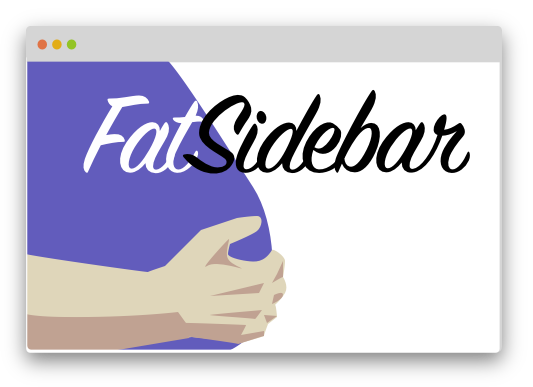
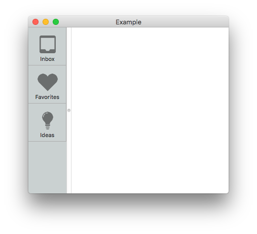
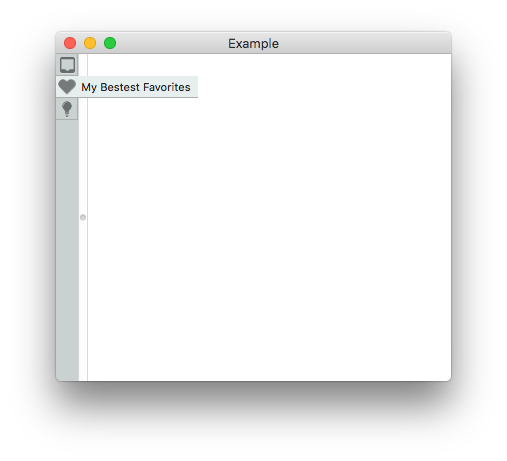
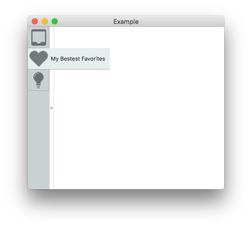

<div align="center">
    
</div>

# FatSidebar


[](https://github.com/Carthage/Carthage)

Custom vertical button toolbar for macOS.

## Item Styles

The component supports 2 different styles: `.regular` and `.small`.

At the moment, `FatSidebar` [does not support responsive switching between styles](https://github.com/CleanCocoa/FatSidebar/issues/1). If you decide to display the sidebar at 50pt width or more, the `.regular` style is a good match.

### Regular Style

The `.regular` style displays the button label right below the icon:



### Small Style

The `.small` style doesn't show the label by default. But when you hover over an item, it expands horizontally to show the label.



This is a good choice for super-long labels that don't fit the regular style.

If you configure the sidebar to be fairly wide, it still works as expected -- but obviously is a lot more spacious.




## Theming

The component's colors can be changed by creating a custom `FatSidebarTheme` implementation:

```swift
public protocol FatSidebarTheme {
    var itemStyle: FatSidebarItemStyle { get }
    var sidebarBackground: NSColor { get }
}

public protocol FatSidebarItemStyle {
    var background: StatefulColor { get }
    var borders: Borders { get }
}
```

`StatefulColor` boils down to a struct with three `NSColor` values for the three states a `FatSidebarItem` can be in: `normal`, `selected`, and `highlighted`. It comes with a convenience initializer in case you don't like when things change in your life: `StatefulColor.init(single:)`

`Borders` is a struct with 4 optional `StatefulColor` objects, one for each side of the item.

### Example Theme

As a hat-tip to the OmniGroup's good-looking sidebar from OmniFocus, here's a theme that's close to OmniFocus's colors:

```swift
struct OmniFocusTheme: FatSidebarTheme {

    let itemStyle: FatSidebarItemStyle = OmniFocusItemStyle()
    let sidebarBackground = OmniFocusTheme.backgroundColor

    static var selectedColor: NSColor { return #colorLiteral(red: 0.901724875, green: 0.9334430099, blue: 0.9331719875, alpha: 1) }
    static var recessedColor: NSColor { return #colorLiteral(red: 0.682291925, green: 0.6823920608, blue: 0.68227005, alpha: 1) }
    static var backgroundColor: NSColor { return #colorLiteral(red: 0.7919496894, green: 0.8197044134, blue: 0.8194655776, alpha: 1) }

    struct OmniFocusItemStyle: FatSidebarItemStyle {

        let background = StatefulColor(
            normal:      OmniFocusTheme.backgroundColor,
            selected:    OmniFocusTheme.selectedColor,
            highlighted: OmniFocusTheme.recessedColor)

        let borders = Borders(
            bottom: StatefulColor(single: OmniFocusTheme.recessedColor),
            right: StatefulColor(
                normal:      OmniFocusTheme.recessedColor,
                selected:    OmniFocusTheme.selectedColor,
                highlighted: OmniFocusTheme.recessedColor))
    }
}
```

## Code License

Copyright (c) 2017 Christian Tietze. Distributed under the MIT License.

## Icon License

Iconic v1.9.0 License. To view Iconic's license, please go to <https://useiconic.com/license/>.
